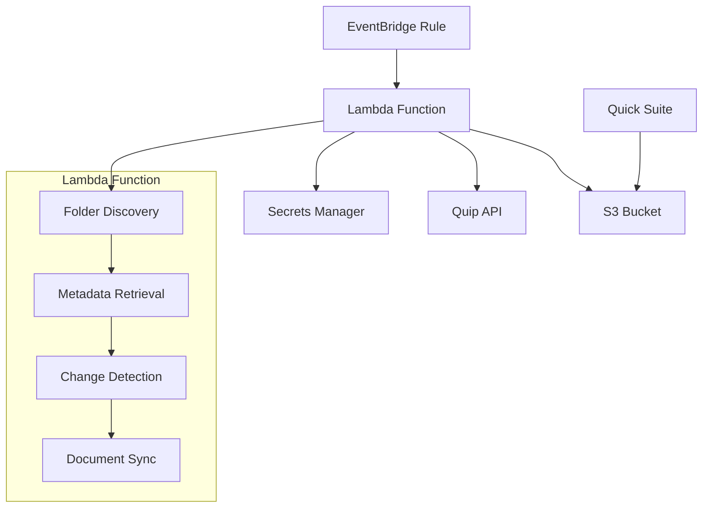

# Design Document

## Overview

The Quip-to-S3 synchronization system is a serverless application that automatically synchronizes documents from nominated Quip folders to an AWS S3 bucket. The system operates as a stateless Lambda function triggered daily by EventBridge, using AWS Secrets Manager for secure credential storage and following infrastructure-as-code principles with AWS CDK.

## Architecture

### High-Level Architecture



### Component Flow

1. **EventBridge Trigger**: Daily execution at midnight Sydney time
2. **Credential Retrieval**: Fetch Quip token and folder IDs from Secrets Manager
3. **Folder Discovery**: Recursively discover all threads in nominated folders
4. **Metadata Collection**: Retrieve thread metadata using Get Threads V2 API
5. **S3 Inventory**: List existing objects in S3 bucket
6. **Change Detection**: Compare Quip thread timestamps with S3 object timestamps
7. **Document Synchronization**: Download and upload changed documents
8. **Cleanup**: Discard all in-memory data structures

## Components and Interfaces

### Lambda Function Handler

**Purpose**: Main entry point for the synchronization process

**Interface**:
```python
def lambda_handler(event: dict, context: LambdaContext) -> dict:
    """
    Main Lambda handler for Quip-S3 synchronization
    
    Args:
        event: EventBridge event payload
        context: Lambda runtime context
        
    Returns:
        dict: Execution summary with sync statistics
    """
```

**Responsibilities**:
- Initialize AWS clients (Secrets Manager, S3)
- Orchestrate the synchronization workflow
- Handle exceptions and logging
- Return execution summary

### Secrets Manager Client

**Purpose**: Secure retrieval of configuration and credentials

**Interface**:
```python
class SecretsClient:
    def __init__(self, secret_name: str):
        """Initialize with configurable secret name"""
        
    def get_quip_credentials(self) -> tuple[str, list[str]]:
        """
        Retrieve Quip access token and folder IDs
        
        Returns:
            tuple: (access_token, folder_ids_list)
        """
```

**Configuration Structure**:
```json
{
    "quip_access_token": "Bearer xyz...",
    "folder_ids": "folder1,folder2,folder3"
}
```

### Quip API Client

**Purpose**: Interface with Quip REST APIs

**Interface**:
```python
class QuipClient:
    def __init__(self, access_token: str):
        """Initialize with access token"""
        
    def get_folder_contents(self, folder_id: str) -> dict:
        """Get folder contents using Get a Folder API"""
        
    def get_threads_metadata(self, thread_ids: list[str]) -> dict:
        """Get thread metadata using Get Threads V2 API"""
        
    def get_thread_html(self, thread_id: str) -> str:
        """Get thread HTML using Get a Thread API"""
```

**API Endpoints**:
- GET `/1/folders/{folder_id}` - Folder contents
- GET `/2/threads` - Thread metadata (batch)
- GET `/1/threads/{thread_id}` - Thread HTML content

### S3 Client

**Purpose**: Manage S3 bucket operations

**Interface**:
```python
class S3Client:
    def __init__(self, bucket_name: str):
        """Initialize with bucket name"""
        
    def list_objects(self) -> dict[str, datetime]:
        """List all objects with modification times"""
        
    def upload_document(self, key: str, content: str, metadata: dict) -> None:
        """Upload document with metadata"""
        
    def generate_object_key(self, link_value: str, title: str) -> str:
        """Generate S3 object key from Quip link and title"""
```

### Synchronization Engine

**Purpose**: Core business logic for change detection and synchronization

**Interface**:
```python
class SyncEngine:
    def discover_threads(self, folder_ids: list[str]) -> dict:
        """Recursively discover all threads in folders"""
        
    def detect_changes(self, quip_threads: dict, s3_objects: dict) -> list[str]:
        """Compare timestamps to identify changed threads"""
        
    def sync_documents(self, changed_thread_ids: list[str]) -> dict:
        """Synchronize changed documents to S3"""
```

## Data Models

### Thread Metadata Model

```python
@dataclass
class ThreadMetadata:
    id: str
    title: str
    link: str
    type: str  # 'DOCUMENT' or 'SPREADSHEET'
    updated_usec: int
    author_id: str
    
    @property
    def updated_datetime(self) -> datetime:
        """Convert microseconds to datetime"""
        return datetime.fromtimestamp(self.updated_usec / 1_000_000)
```

### S3 Object Model

```python
@dataclass
class S3Object:
    key: str
    last_modified: datetime
    size: int
    etag: str
```

### Sync Result Model

```python
@dataclass
class SyncResult:
    total_threads_discovered: int
    documents_processed: int
    spreadsheets_skipped: int
    documents_uploaded: int
    documents_unchanged: int
    errors: list[str]
    execution_time_seconds: float
```

## Error Handling

### Exception Hierarchy

```python
class QuipSyncError(Exception):
    """Base exception for sync operations"""

class QuipAPIError(QuipSyncError):
    """Quip API communication errors"""

class S3OperationError(QuipSyncError):
    """S3 operation errors"""

class SecretsManagerError(QuipSyncError):
    """Secrets Manager access errors"""
```

### Error Handling Strategy

1. **Retry Logic**: Implement exponential backoff for transient API failures
2. **Partial Failure Handling**: Continue processing other documents if individual documents fail
3. **Logging**: Comprehensive CloudWatch logging for debugging
4. **Alerting**: CloudWatch alarms for critical failures

### Error Recovery

- **API Rate Limits**: Implement backoff and retry with jitter
- **Network Timeouts**: Configure appropriate timeouts and retries
- **Authentication Failures**: Log error and terminate execution
- **S3 Upload Failures**: Retry with exponential backoff

## Testing Strategy

### Unit Testing

**Scope**: Individual components and functions
**Framework**: pytest with mocking
**Coverage Target**: >90% code coverage

**Test Categories**:
- Quip API client methods
- S3 operations
- Change detection logic
- Object key generation
- Error handling scenarios

### Integration Testing

**Scope**: Component interactions
**Environment**: LocalStack for AWS services

**Test Scenarios**:
- End-to-end synchronization flow
- Secrets Manager integration
- S3 bucket operations
- Error propagation

### Performance Testing

**Metrics**:
- Lambda execution time (target: <15 minutes)
- Memory usage (target: <1GB)
- API call efficiency
- S3 upload throughput

## Infrastructure Design

### AWS CDK Stack Structure

```python
class QuipSyncStack(Stack):
    def __init__(self, scope: Construct, construct_id: str, 
                 custom_name: str,
                 quicksight_principal_id: str = None, **kwargs):
        # CloudFormation stack name format: QuipSyncStack-<custom_name>
        # S3 Bucket with name format: <AWS Account ID>-quip-sync-<custom_name>
        # Secrets Manager secret with name format: quip-sync-<custom_name>-credentials
        # Bucket policy with configurable QuickSightDataSourceCreatorPrincipalId
        # Lambda Function with Python 3.13 runtime
        # EventBridge Rule with Sydney timezone schedule
        # IAM roles and policies
        # CloudWatch log groups
```

### Lambda Configuration

- **Runtime**: Python 3.13
- **Memory**: 1024 MB
- **Timeout**: 15 minutes
- **Environment Variables**: 
  - S3_BUCKET_NAME: `<AWS-Account-ID>-quip-sync-<custom-name>`
  - SECRET_NAME: `quip-sync-<custom-name>-credentials`
- **VPC**: No VPC (public internet access required for Quip API)

### EventBridge Schedule

- **Schedule Expression**: `cron(0 14 * * ? *)` (midnight Sydney time in UTC)
- **Target**: Lambda function with retry policy
- **Error Handling**: Failed executions log errors to CloudWatch logs

### IAM Permissions

**Lambda Execution Role**:
- `secretsmanager:GetSecretValue` - Read Quip credentials
- `s3:ListBucket` - List S3 objects
- `s3:GetObject` - Read existing S3 objects
- `s3:PutObject` - Upload new/updated documents
- `logs:CreateLogGroup`, `logs:CreateLogStream`, `logs:PutLogEvents` - CloudWatch logging

### S3 Bucket Policy

The bucket policy will be dynamically generated during CDK deployment with configurable parameters:

```python
# CDK deployment parameters
quicksight_principal_id = "user/d-12345abcde/S-1-2-34-1234567890-1234567890-1234567890-1234567890"  # Configurable
quicksight_namespace = "default"  # Configurable
service_role_arn = "arn:aws:iam::123456789012:role/service-role/aws-quicksight-service-role-v0"  # Configurable
```

**Generated Bucket Policy**:
```json
{
    "Version": "2012-10-17",
    "Statement": [
        {
            "Sid": "AllowQuickSuite",
            "Effect": "Allow",
            "Principal": {
                "AWS": "${service-role-arn}"
            },
            "Action": [
                "s3:GetObject",
                "s3:ListBucket",
                "s3:GetBucketLocation",
                "s3:GetObjectVersion",
                "s3:ListBucketVersions"
            ],
            "Resource": [
                "arn:aws:s3:::${aws-account-id}-quip-sync-${custom-name}",
                "arn:aws:s3:::${aws-account-id}-quip-sync-${custom-name}/*"
            ],
            "Condition": {
                "StringEquals": {
                    "aws:PrincipalTag/QuickSightDataSourceCreatorPrincipalId": "${quicksight-principal-id}",
                    "aws:PrincipalTag/QuickSightNamespace": "${quicksight-namespace}"
                }
            }
        }
    ]
}
```

**CDK Deployment Command**:
```bash
cdk deploy QuipSyncStack-my-sync --parameters customName="my-sync" --parameters quicksightPrincipalId="user/..." --parameters quicksightNamespace="default"
```

## Security Considerations

### Credential Management

- Quip access token stored in AWS Secrets Manager
- Folder IDs stored alongside token in same secret
- Lambda function uses IAM role for AWS service access
- No hardcoded credentials in code or environment variables

### Network Security

- Lambda function requires internet access for Quip API
- S3 bucket access restricted to Quick Suite service role
- CloudWatch logs for audit trail

### Data Protection

- Documents stored in S3 with server-side encryption
- Access logging enabled on S3 bucket
- Secrets Manager automatic rotation capability (manual setup required)

## Monitoring and Observability

### CloudWatch Metrics

- Lambda execution duration
- Lambda error rate
- S3 upload success/failure rates
- API call latencies

### CloudWatch Alarms

- Lambda function failures
- Execution timeout warnings
- High error rates from Quip API
- S3 upload failures

### Logging Strategy

- Structured JSON logging
- Correlation IDs for request tracing
- Performance metrics logging
- Error details with context

## Deployment Strategy

### CDK Deployment

1. **Bootstrap**: CDK bootstrap in target AWS account/region
2. **Deploy**: `cdk deploy` with custom stack name and parameters
   ```bash
   cdk deploy QuipSyncStack-my-sync --parameters customName="my-sync" \
              --parameters quicksightPrincipalId="user/..." \
              --parameters quicksightNamespace="default" \
              --parameters serviceRoleArn="arn:aws:iam::account:role/..."
   ```
3. **Configuration**: Manual setup of Secrets Manager values in the created secret
4. **Testing**: Execute Lambda function manually to verify setup

### Environment Management

- **Development**: Separate stack with test Quip folders
- **Production**: Production stack with live Quip folders
- **Configuration**: Environment-specific parameter files